## Instalacion de Apache, PHP, MySQL, PHPMyAdmin, Laravel, Composer, VSCode y Git en Ubuntu, Debian Y derivados

Elaborado por Fernando Duarte Villavicencio.

Si tu GNU/Linux esta basado en Arch Linux visita mi otro repositorio [Instalacion de NGINX, PHP, MySQL, PHPMyAdmin, Laravel, Composer, VSCode y Git en Arch Linux y derivados](https://github.com/Du-F23/LEMP-Laravel-Composer-Arch-y-derivados.io)
________________________________

# Instalacion de Apache Web Server

Para empezar debemos actualizar todas nuestras aplicaciones
>`sudo apt update && sudo apt upgrade`

Para instalar Apache Web Server usariamos

>`sudo apt install apache2`

Activamos y habilitamos Apache Web Server
>`systemctl enable apache2`
>
>`systemctl start apache2`
>

________________________________

# Instalacion de MySQL o Maria DB

Usaremos el siguiente comando
>`sudo apt install mariadb-server`
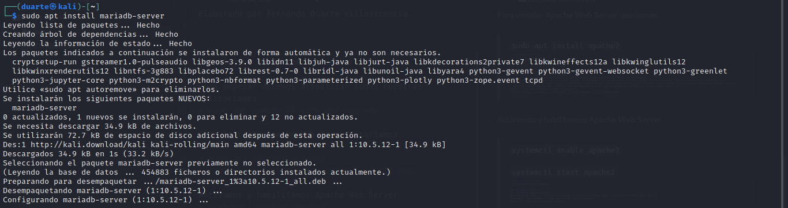

Activamos y habilitamos Maria DB
>`systemctl enable mariadb`
>
>`systemctl start mariadb`
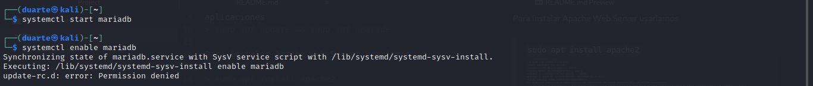

Habilitamos una contraseña para Maria DB

>`sudo mysql_secure_installation`
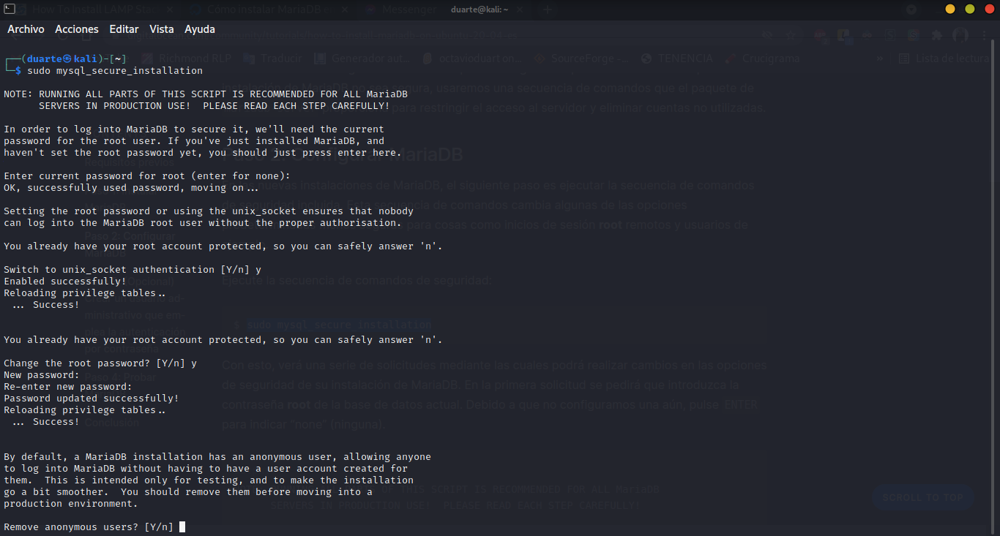
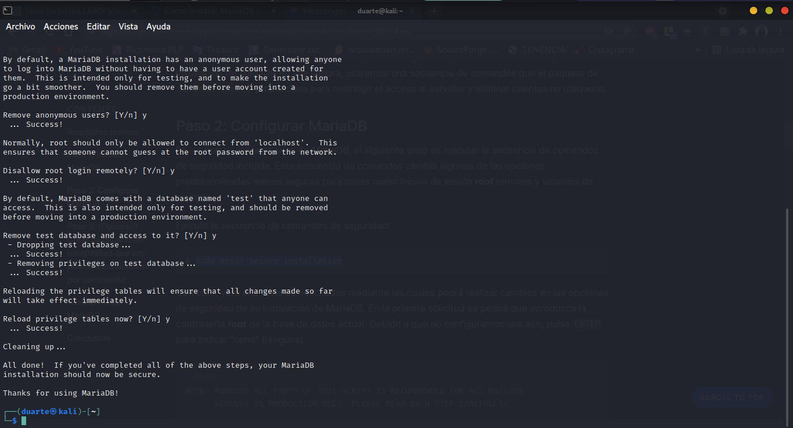

Para ingresar a Maria DB en terminal usariamos

>`sudo mysql -u root -p`
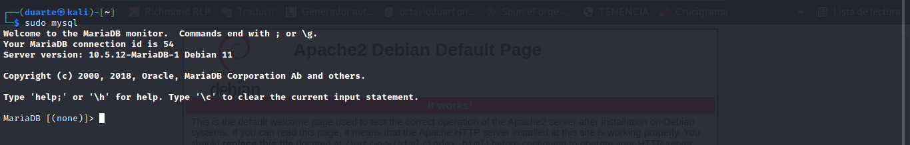

________________________________
# Instalacion de PHP

Para instalar PHP usariamos lo siguiente

> `sudo apt install php libapache2-mod-php php-mysql`
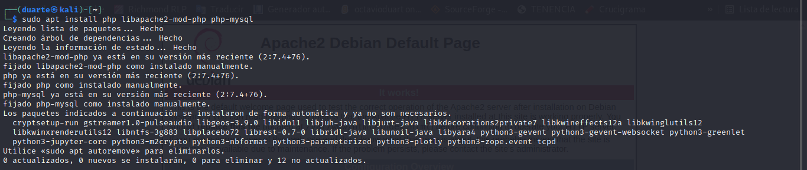

Para verificar si Apache Web Server se conecta con PHP crearemos el siguiente archivo.

>`cd /var/www/html/`

Aqui mismo crearemos un archivo con extension __**.php**__
(__**Podemos nonbrarlo como sea nuestro gusto, solo necesitariamos que termine en .php**__).

__**Los comandos que usaremos para usar nano de forma correcta son los siguientes**__
- ctrl + x (Para salir del editor)
- ctrl + o (Para guardar los cambios dentro del archivo)
- ctrl + w (Buscar alguna linea)

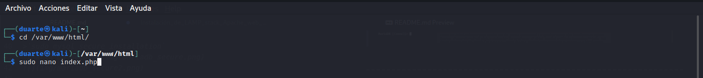

Añadiremos lo siguiente

> `<?php`
>
>`phpinfo();`
>
>`?>`
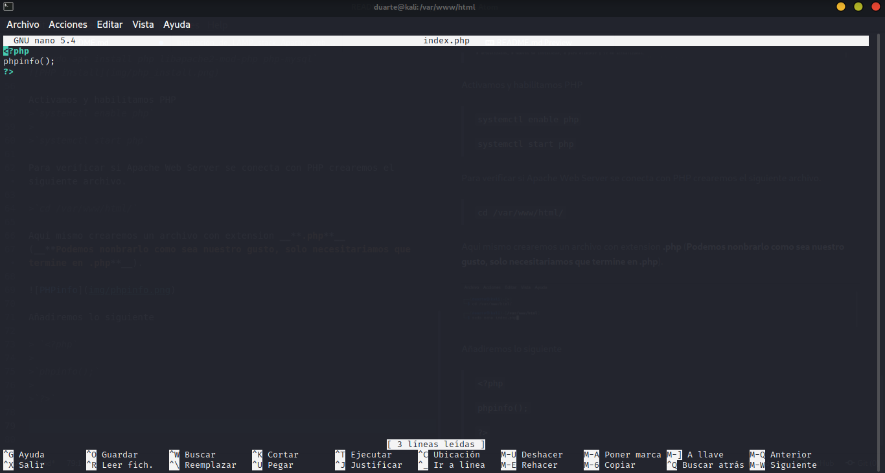

En el navegador deberiamos ver lo siguiente

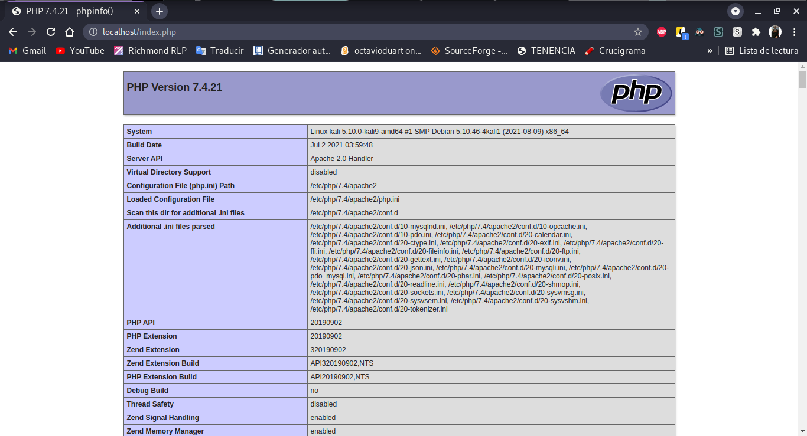

________________________________

# Instalacion de PHPMyAdmin

Para empezar a instalar phpMyAdmin necesitariamos de 2 aplicaciones
__**wget y unzip**__, las cuales se instalan de la siguiente forma

>`sudo apt install wget unzip`
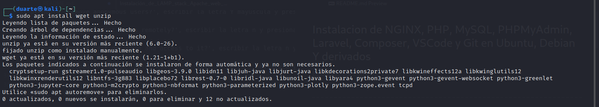

Ahora descargaremos el paquete de phpMyAdmin con el siguiente comandos

>`wget https://files.phpmyadmin.net/phpMyAdmin/5.1.1/phpMyAdmin-5.1.1-all-languages.zip`
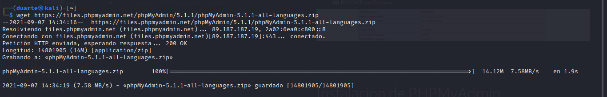

Ahora extraeremos el archivo en la siguiente pregunta

>`sudo unzip phpMyAdmin-5.1.1-all-languages.zip -d /var/www/html/`
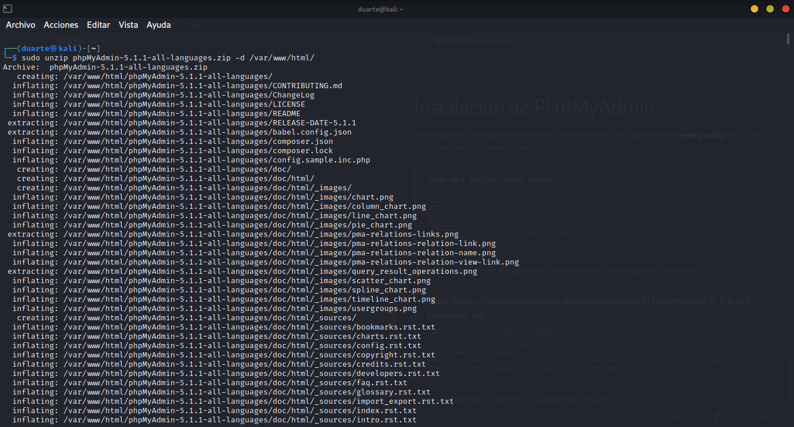>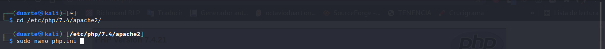

Y una vez terminado entrariamos a la siguiente carpeta __**/var/www/html**__

>`cd /var/www/html`

Renombrariamos la carpeta extraida a phpmyadmin
>`sudo mv phpMyAdmin-5.1.1-all-languages phpmyadmin`
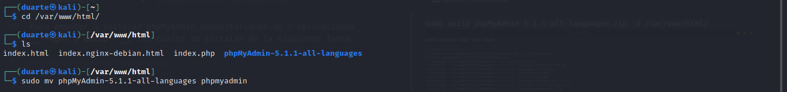

Entramos a la carpeta phpmyadmin
>` cd phpmyadmin`
>
>`sudo cp config.sample.inc.php config.inc.php`
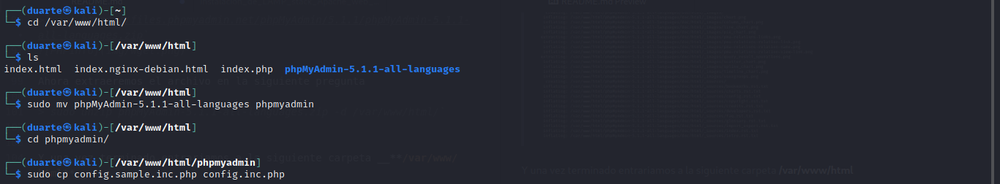

Cambiamos los permisos de config.inc.php
>`sudo chmod 660 config.inc.php`
>
>`sudo chown -R www-data:www-data`
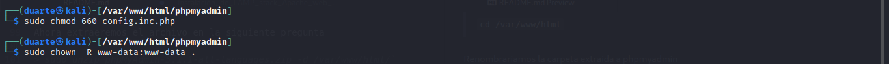

Reiniciaremos Apache Web server

>`systemctl restart apache2`
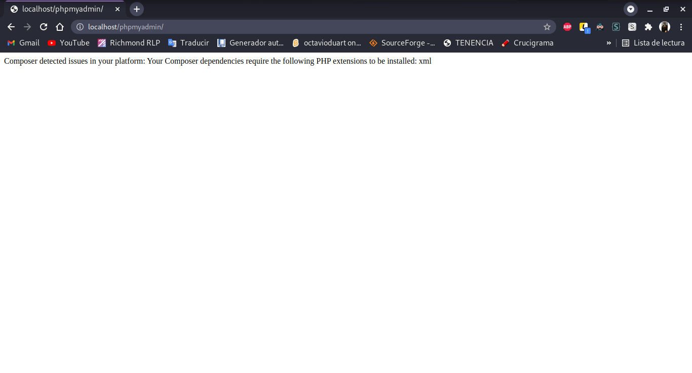

Para solucionar el problema que aparece buscaremos la extension que nos pide
>`cd /etc/php/7.4/apache2/`
>
>`sudo nano php.ini`
>

__**Los comandos que usaremos para usar nano de forma correcta son los siguientes**__
- ctrl + x (Para salir del editor)
- ctrl + o (Para guardar los cambios dentro del archivo)
- ctrl + w (Buscar alguna linea)

Veriamos lo siguiente
>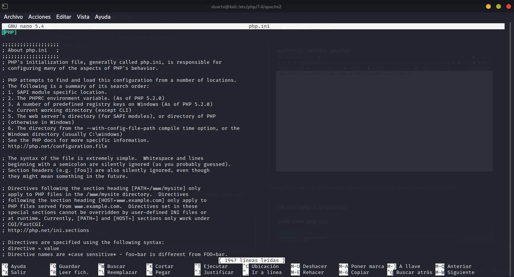

Buscamos o creamos la extension xml (Si en nuestro caso si existe, tendremos que borrar __**;**__ que aparece al principio)

Instalaremos la siguiente extension
>`sudo apt-get install php-xml`
>
>Y la habilitamos en php.ini
>
>`extension=xml`
>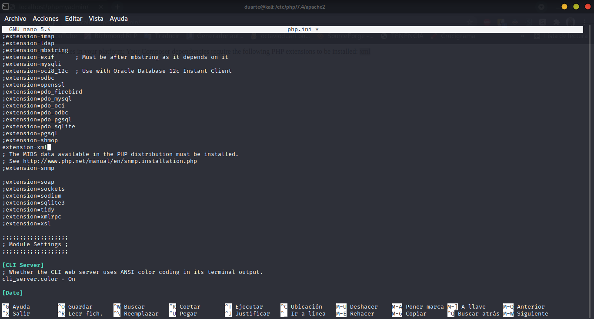

Y reiniamos Apache Web Server
>`systemctl restart apache2`
>
>Y ya tendremos acceso a phpMyAdmin
>
>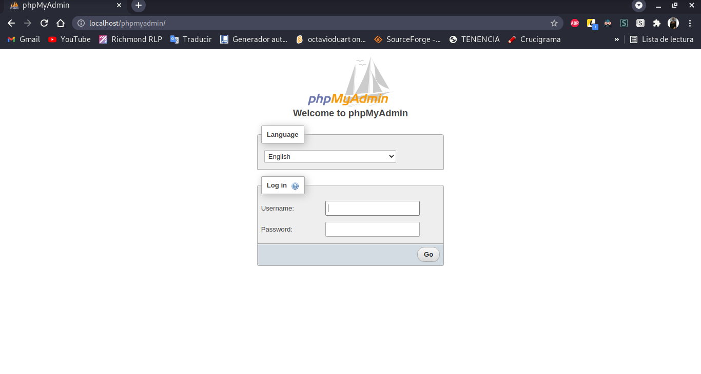

Si nos aparece un panel con el siguiente error 'phpMyAdmin error: The $cfg['TempDir'] (./tmp/) is not accessible' [Click aqui](https://www.discoverbits.in/2122/phpmyadmin-error-the-$cfg-tempdir-tmp-is-not-accessible)
________________________________

# Instalación de Composer y Laravel

Descargamos composer

>`php -r "copy('https://getcomposer.org/installer', 'composer-setup.php');"`
>
>Ejecutaremos el instalador de composer
>
>`sudo php composer-setup.php --install-dir=/bin --filename=composer`

Ahora procederemos a instalar laravel
>`composer global require laravel/installer`

Escribimos lo siguiente

>`echo 'export PATH="$PATH:$HOME/.config/composer/vendor/bin"' >> ~/.bashrc`
>
> `echo 'export PATH="$PATH:$HOME/.composer/vendor/bin"' >> ~/.bashrc`
>
>Recargamos el archivo
>
>`source ~/.bashrc`
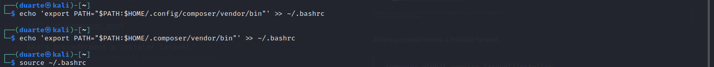

Para verificar si laravel esta siendo reconocida haremos lo siguiente

__**Para poder cargar laravel una vez cerrada la terminal lo unico que tenemos que hacer es lo siguiente**__

>`source ~/.bashrc`
>
>`laravel`

Para crear aplicaciones usando laravel usamos lo siguiente

>`laravel new laravel_prueba`

________________________________
# Instalacion de Visual Studio Code

Para instalar VS Code ingresaremos al siguiente sitio
[VS Code Debian Ubuntu](https://code.visualstudio.com/).

Y descargaremos la version __**.deb**__
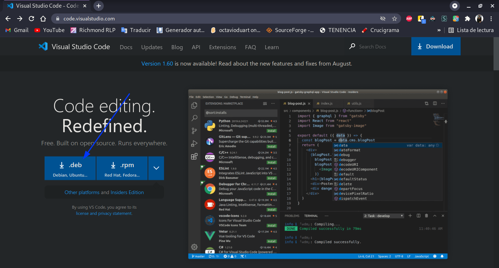

Una vez descargada abrimos una terminal e ingresaremos a la ruta de
descarga

Ejecutaremos el siguiente comando para su instalación
>`sudo apt install ./code_1.60.0-1630494279_amd64.deb`
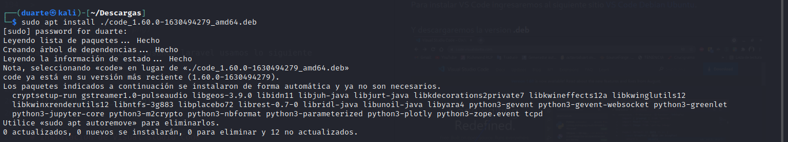

________________________________

# Instalación de Git

Git se instalaria de la siguiente manera
>`sudo apt install git`
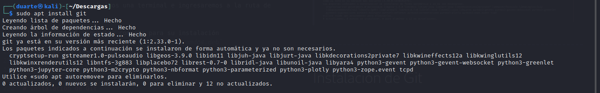

Si deseamos configurar Git, te invito a visitar mi otro repositorio [Git Configuracion](https://github.com/Du-F23/git)
